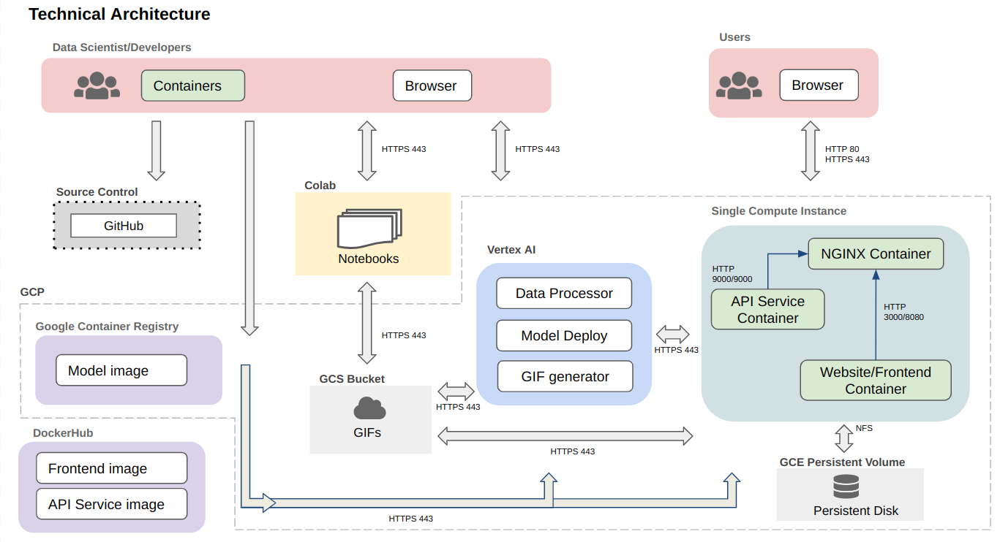

# MOMA Lisa
### Nora Hallqvist, Anna Midgley, Sebastian Weisshaar

**Project Description:**
Our project takes a user's prompt for two points, and generates a continuous series MoMa artworks transitioning between them.
We achieve this by transversing through the latent space, creating intermediate points between the two given points, from which we can decode 
and generate images from. The images are then used to produce a gif, which is displayed to the user.

**Project Journey:**
This is not the first topic we have investigated in this project. Previously, we were hoping to use image and generated caption pairs, to fine-tune a stable diffusion model on MoMA artworks. We set up severless training, that utilized images & captions stored in a GCP bucket with WandB used to track
model training. However, we realized that the model was already to good and consequently we were unable to teach the model anything. For this reason, we decided to pivot to a different idea. We experimented with instead trying to learn specific lesser known artists styles. Unfortunately we realized that for any artist that had satisfactory set of artworks available, the model already knew the style, and again found ourselves unable to teach the model anything. Thus, we have switched to our current topic. It should be noted that the following folders of work in `src` are from previous project
ideas and not applicable to our current idea: `train`, `preprocess`, `scrape`, `data`. 

### Project organization 

    ├── LICENSE
    ├── README.md
    ├── data.dvc
    ├── imgs
    │   ├── ...
    ├── reports
    │   ├── milestone2.md
    │   ├── milestone3.md
    │   └── milestone4.md
    └── src
        ├── docker-compose.yml
        ├── preprocess
        │   ├── Dockerfile
        │   ├── preprocess.py
        │   └── requirements.txt
        ├── scrape
        │   ├── Dockerfile
        │   ├── Pipfile
        │   ├── Pipfile.lock
        │   └── scraper.py
        ├── secrets
        │   ├── data-service-account.json
        │   └── wandb_api_key.json
        ├── train
            ├── Dockerfile
            ├── fetch_train_data.py
            ├── requirements.txt
            ├── train.sh
            └── training_setup.sh
        ├── deploy
            ├── app.py
            ├── Dockerfile
            └── requirements.txt
        └── workflow
            ├── Dockerfile
            ├── pipeline.py
            ├── pipeline.yaml
            └── requirements.txt

### Code structure
* `src/preprocess/preprocess.py` : Fetches MOMA images from 'moma_scrape' GCP bucket, converts the images to png formate and annotates them by generate a text caption and uploads to 'preprocess_data' bucket.

* `src/scrape/scraper.py` : Scrape MOMA collection of artworks currently on display and store jpeg files in 'moma_scrape' GCP bucket. 

* `src/train/fetch_train_data.py` : Fetch training data from 'preprocess_data' bucket and store it for training. 

* `src/train/training_setup.sh` : Collect data and utils file for training. 

* `src/train/train.sh` : Start the fine-tuning of Stable Diffusion, **requires** to first run `training_setup.sh`

* `src/deploy/app.py` : Flask app to deploy model on Vertex AI.

* `src/workflow/pipeline.py` : Create & run pipeline on Vertex AI.

### Bucket structure 
The following is our current structue of files on Google Cloud Storage.

    ├── saved_predictions
    │   └── instance_id
    │       ├── unique_name.gif
            ├── ...

The following is the previous structure of our files. DVC tracking was used to ensure data management, and version control over our data. The `moma_scrape` bucket contained the raw images that were scrapped from the MOMA website. 
The `preprocess_data` bucket contained the processed images, with their corresponding captions. The text captions were stored in the JSONL file. The JSONL file consisted of a series of dictionaries, with each dictionary comprising two  keys: 'file_name' and 'text.' The 'file_name' key corresponds to the image's name, while the 'text' key is the image's caption. The `momalisa_model` bucket stored our model. 

    ├── dvc tracking
    │   ├── ...
    ├── moma_scrape
    │   └── imgs/
    │       ├── ...
    ├── momalisa_model
    ├── preprocess_data
    │   └── train/
    │       ├── metadata.jsonl
            ├── moma_0.png
            ├── moma_1.png
            ├── ...
        

## AC215 - Milestone 5 - MOMA Lisa

This Milestone encompassed:
1. Application Design Document
2. APIs & Frontend Implementation

### Application Design Document
**Solution Architecture:**
The solution architecture for our application is spit between process, execution and state. The solution architecture 
subsections are described in the diagram below, and the entire flow diagram linking the subsections depicted in the diagram after. 

<figure>
    
    <figcaption>MoMA Lisa Solution Architecture SubSections </figcaption>
</figure>

<figure>
    
    <figcaption>MoMA Lisa Solution Architecture Flow Diagram</figcaption>
</figure>

**Technical Architecture:**
The technical architecture provides a high level view from development to deployment, illustrating the interactions
between components and containers. It provides the blueprint of the system, helping to understand how the system will work. 

For source control, we will use GitHub to keep track of our code & the changes to it. We will use Vertex AI & GCP for model deployment, 
and GCR to host the needed container images. GCS buckets will be used to store the outputted gifs. GCE persistent volume
will be used to store any files that need to be persisted when container images are updated. We will use a virtual machine instance
on GCE to host a single instance with all the needed containers running on it. 

The technical architecture, and the interactions between the components and containers are depicted in the diagram below.

<figure>
    
    <figcaption>MoMA Lisa Technical Architecture </figcaption>
</figure>

### APIs & Frontend Implementation
**APIs:**
ADD A DESCRIPTION OF THE APIs WE HAVE

**Frontend:**
The frontend we have created allows a user to input two objects, from which a gif will be generated that captures the 
latent space walk. The outputted gif can be downloaded from the website. The user's input is processed, and then passed 
to the model for prediction. The outputted gif is saved to GCS buckets, and then displayed to the user. Our website additionally
has a GIF gallery, where users can view previously generated gifs and gain inspiration. Lastly it has a small section
discussing the project, link to our source code, and the team members. 

INCLUDE SCREENSHOTS OF WEBSITE

### Ansible
Ansible is a tool that allows us to automate the deployment of our application. The following commands are used to deploy our application:
1. Build the deployment container: `sh docker-shell.sh`
2. Build & push docker containers to GCR (if you haven't already): `ansible-playbook deploy-docker-images.yml -i inventory.yml`
3. Create a VM instance in GCP: `ansible-playbook deploy-create-instance.yml -i inventory.yml --extra-vars cluster_state=present`
4. Provision the VM instance: `ansible-playbook deploy-provision-instance.yml -i inventory.yml`
- note: check that the VM instance on GCP external IP matches the one in inventory.yml
5. Set up the containers: `ansible-playbook deploy-setup-containers.yml -i inventory.yml`
6. Check that containers are running by SSH into instance & running `sudo docker container ls` or `sudo docker container logs api-service -f`
7. Deploy the webserver: `ansible-playbook deploy-setup-webserver.yml -i inventory.yml`
8. Visit the website: `http://<external_ip>`
9. Delete the VM instance: `ansible-playbook deploy-create-instance.yml -i inventory.yml --extra-vars cluster_state=absent`

These commands take care of creating the different docker images, uploading them to GCR, creating a VM instance, 
establishing a docker network, and running the docker containers. 