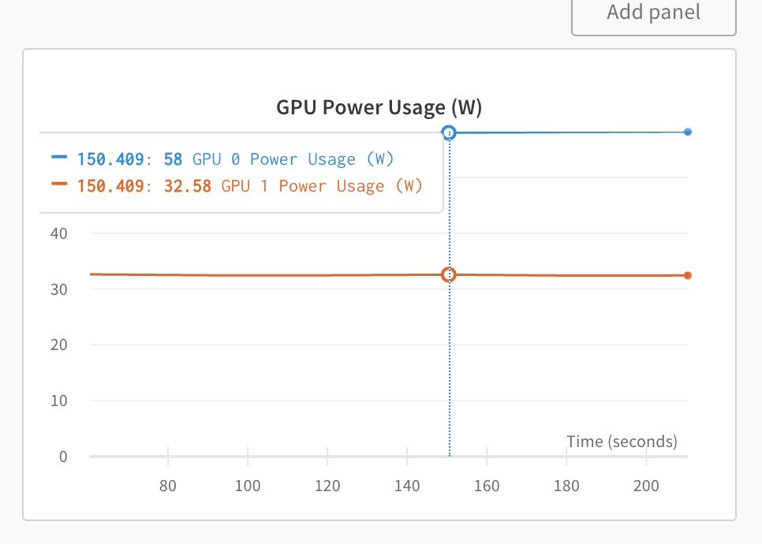
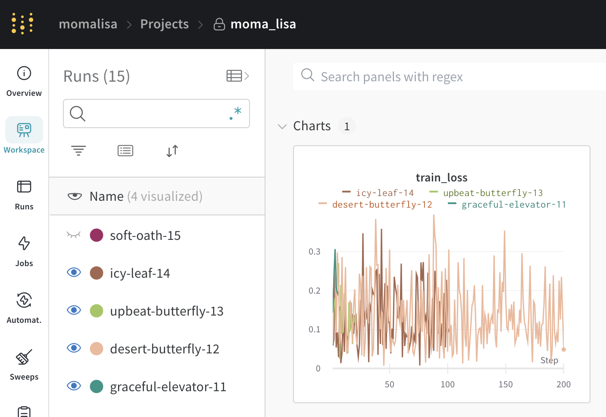
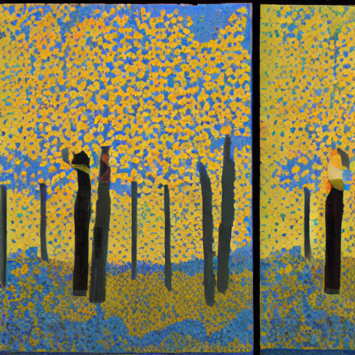
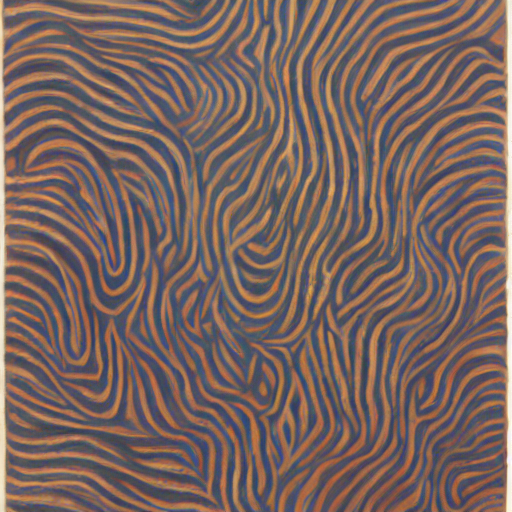
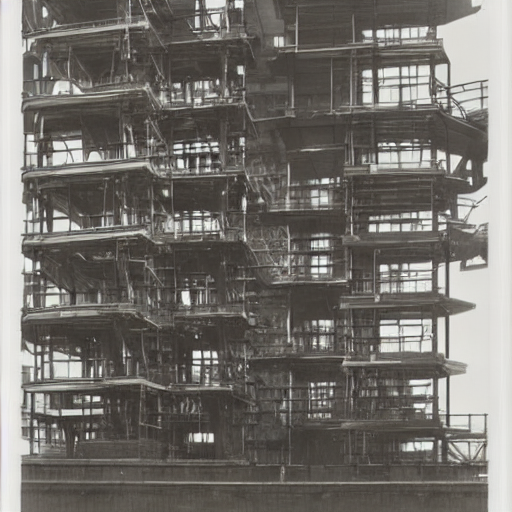
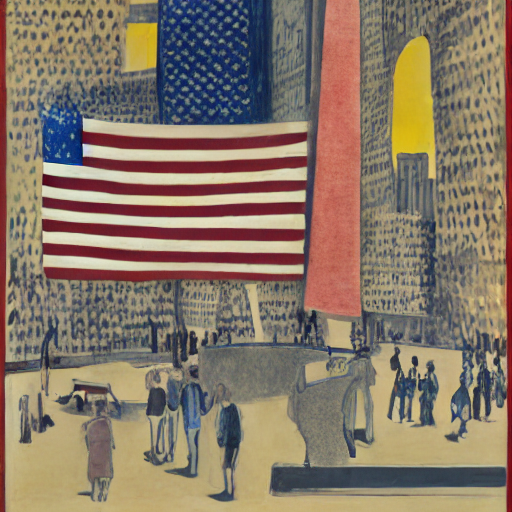
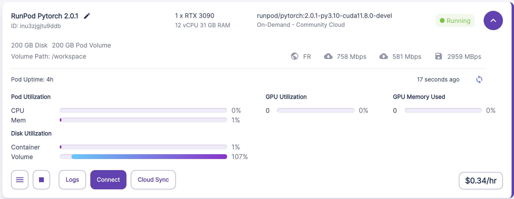

# MOMA Lisa'
### Nora Hallqvist, Anna Midgley, Sebastian Weisshaar

TODO: mention cloud storage solutions
TODO: Multi-GPU, mention severless


**Project Description:**
Our project takes a user's prompt, and generates a MoMa artwork. We finetune Stable Diffusion with the artworks currently on display in the Museum Of Modern Art (MOMA) in New York. 

### Project organization 

    ├── LICENSE
    ├── README.md
    ├── data.dvc
    ├── imgs
    │   ├── ...
    ├── reports
    │   ├── milestone2.md
    │   └── milestone3.md
    └── src
        ├── docker-compose.yml
        ├── preprocess
        │   ├── Dockerfile
        │   ├── preprocess.py
        │   └── requirements.txt
        ├── scrape
        │   ├── Dockerfile
        │   ├── Pipfile
        │   ├── Pipfile.lock
        │   └── scraper.py
        ├── secrets
        │   ├── data-service-account.json
        │   └── wandb_api_key.json
        └── train
            ├── Dockerfile
            ├── fetch_train_data.py
            ├── requirements.txt
            ├── train.sh
            └── training_setup.sh

### Code structure
* `src/preprocess/preprocess.py` Fetches MOMA images from 'moma_scrape' GCP bucket, converts the images to png formate and annotates them by generate a text caption and uploads to 'preprocess_data' bucket.

* `src/scrape/scraper.py` Scrape MOMA collection of artworks currently on display and store jpeg files in 'moma_scrape' GCP bucket. 

* `src/train/fetch_train_data.py` Fetch training data from 'preprocess_data' bucket and store it for training. 

* `src/train/training_setup.sh` Collect data and utils file for training. 

* `src/train/train.sh` Start the fine-tuning of Stable Diffusion, **requires** to first run `training_setup.sh`

### Bucket structure 
The following is structure of our files on Google Cloud Storage. DVC tracking ensures data management, and version
control over our data. The `moma_scrape` bucket contains the raw images that were scrapped from the MOMA website. 
The `preprocess_data` bucket contains the processed images, with their corresponding captions. The text captions are stored in the JSONL file. The JSONL file consists of a series of dictionaries, with each dictionary comprising two  keys: 'file_name' and 'text.' The 'file_name' key corresponds to the image's name, while the 'text' key is the image's caption.


    ├── dvc tracking
    │   ├── ...
    ├── moma_scrape
    │   └── imgs/
    │       ├── ...
    ├── preprocess_data
    │   └── train/
    │       ├── metadata.jsonl
            ├── moma_0.png
            ├── moma_1.png
            ├── ...
        

## AC215 - Milestone 3 - MOMA Lisa

### Milestone 3
Milestone 3 contains two changes: 1) we changed the topic of the project from recipes to art and 2) we implemented the training pipeline. 

Our new project topic is creating art using AI. This is inspired by a current [artwork]('https://www.moma.org/calendar/exhibitions/5535') on display at the MOMA. The installation creates novel art in real time. Whilst it is captivating to watch the algorithm, we missed the chance to interact with it rather than only observe. Our project therefore is to create an installation that allows visitors to create art with their input. For now the user interacts through text with this installtion but as a next step we will allow for image input as well. 

### Data and Preprocessing
We scraped the artworks currently on display at the MOMA from their [website]('https://www.moma.org/collection/'). These images are then stored in a Google Cloud Platform bucket. For the preprocessing all images are annotated using a image-to-text model. We used the freely accessible Salesforce ["blip-image-captioning-base"]('https://huggingface.co/Salesforce/blip-image-captioning-base')model.  We also prepend the string "A MOMA artwork of: " to these annotations. The MOMA art work together with these descriptions form our training data. The processed MOMA images together with the annotations are stored in a GCP bucket as well. 
During training this dataset is fetched and processed through a Torch DataLoader. This provides an efficient data loading
and batching capabilities that will enable our project to scale. We use this in place of TFRecords, as we are using Pytorch. 
The processing of our data caption generation, requiring GPUs. Dasks is not helpful here, as we are using GPUs, and not needing
to parallelize across multiple CPU cores. We use DVC to manage our data, and ensure that it is tracked and versioned.

### Machine Learning Workflow
As a base model we use ["CompVis/stable-diffusion-v1-4"]('https://huggingface.co/CompVis/stable-diffusion-v1-4') which is a pre-trained SD model. 
To finetune we modified the finetuning script from [Diffusers]('https://github.com/huggingface/diffusers'). To do so we clone the Diffusers GitHub repository and switch the training file with our version. In this way we can make use of their utils and dependencies. 

Our changes to the script are in the formatting of the training data, connecting to W&B, and managing dependencies. For Milestone 3 our largest experiment was with 200 out of the 1200 images. The code makes use of accelerate to optimize GPU usage and deploys Pytorch for the neural networks. We have implemented multi-GPU and run a short run on it. The figure shows how two GPU are run simultaneously. 
<figure>
    
    <figcaption>Multi GPU training</figcaption>
</figure>

### Experiment tracking
We tracked our training using [Weights and Biases]('https://wandb.ai/site'). First we ran 3 smaller experiments to see if the training works correctly, the validation prompts are evaluated and the loss is decreasing. The graph shows a jumpy loss function during training. Based on this graph and the caveat on [HuggingFace]('https://huggingface.co/docs/diffusers/v0.13.0/en/training/text2image') about catastrophic forgetting we decided to reduce our learning rate from 10e-8 to 10e-9. 

<figure>
    
    <figcaption>W&B loss logging</figcaption>
</figure>


During training five evaluation prompts are evaluated every 250 steps. These prompts give us an insight into the style SD is using. The standard loss function is not of much use for our use case. We try to teach SD an 'artsy' style, which is not captured by a loss function comparing two images but has to be evaluated by humans. The prompts are: 

1. A MOMA artwork of: changing seasons
2. A MOMA artwork of: a coffee
3. A MOMA artwork of: an industrial setting
4. A MOMA artwork of: critique of the USA
5. A MOMA artwork of: Picasso and Monet. 

We cherry picked an example for each of these prompts from our training.
<figure style="float: left">
    
    <figcaption>A MOMA artwork of: changing seasons</figcaption>
</figure> 
<figure style="float: right">
    
    <figcaption>A MOMA artwork of: a coffee</figcaption>
</figure> 
<figure style="float: left">
    
    <figcaption>A MOMA artwork of: an industrial setting</figcaption>
</figure> 
<figure style="float: right">
    
    <figcaption>A MOMA artwork of: critique of the USA</figcaption>
</figure> 
<figures style="float: center">
    
    <figcaption>A MOMA artwork of: Picasso and Monet</figcaption>
</figure> 

We also use W&B Artifacts to save our model. 

### Serverless training
We use [RunPod]('https://www.runpod.io/) to run our training. RunPod rents out different GPU per hour, with high availibilty. You can also use it for mutli-GPU training. For our Stable Diffusion finetuning we used a single RTX 3090 GPU with 24GB of VRAM. The fine-tuning training takes ~2.5 hrs on this GPU. 
<figure>
    
    <figcaption>GPU specification and cost on RunPod. </figcaption>
</figure>

### Containers
We currently have 3 containers setup, namely for scraping, preprocessing, and training. The first two containers are from
the previous milestone but updated for our new project idea. The training container is new, and is the focus of this milestone.
This container contains all our training scripts, and modelling components. This container contains
Google Cloud Service credentials, and thus can easily access our GCP buckets. It will fetch data from our GCP buckets. 
We made the decision to save our model to Weights & Biases rather than to a GCP bucket, as we are already using W&B for
experiment tracking and it is convenient. Our docker is based on a CUDA version of Pytorch image, which
contains the GPU-related libraries for deep learning. We use a requirements.txt file to install the necessary packages. 

### Current training pipeline:
It should be noted that before training, preprocessing needs to be run. Preprocessing can be run by following the steps,
```bash
docker pull amidgley/preprocess:linux_3.0
docker compose run preprocess
python preprocess/preprocess.py
```
The following are the steps required to implement the training pipeline.
1. Start a Docker container
This step pulls a docker container form dockerhub, that has all the necessary packages & dependencies installed to run training.
```bash
docker pull amidgley/train:linux_2.0
docker compose run train
```
This will launch a bash shell within the container, in the `train` folder. The next steps assumed that you are in the 
root folder, one level higher than `train`. The reason for this layout choice is to ensure proper linkage with the
secrets directory. 

2. Setup for training
This step clones the diffuser github, moves our training script to the correct location within it, 
fetches the data from the GCP bucket & preprocesses it, ready for training. 

```bash
sh train/training_setup.sh
```

3. Initiate training
This script sets the necessary environment variables to connect to Weights & Biases, for experiment tracking, 
and initiates training. The trained model's artifacts will be saved to Weights & Biases. Our Weights & Biases API key
is contained within the secrets folder. 

```bash
sh train/train.sh
```

### Future Improvements
We are aware that this project is a work-in-progress, and the following list describes steps that we want to make in the future, to improve it. 
1. Remove downloading of files from the GCP bucket
- We think that it will be more efficient to process the data directly from the bucket rather than saving the files to disk, then loading them when using them. 
2. Store data in a ready-to-use form
- This will help improve workflow, as this will allow us to bypass the preprocessing done in `fetch_train_data.py`. In addition to saving the raw images on the GCP buckets, we should save the images & captions, in the format that is compatitble with our Pytorch dataloader.
3. Improve model performance
- Our model is learning, but there is room for better fine-tuning. One way that we see that we can do this, is by using longer captions in training. Instead of using current captioning model, we propose using [SceneXplain](https://scenex.jina.ai/). 