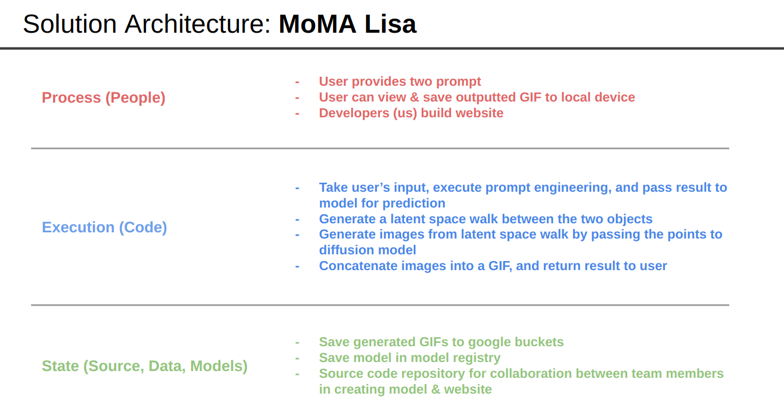
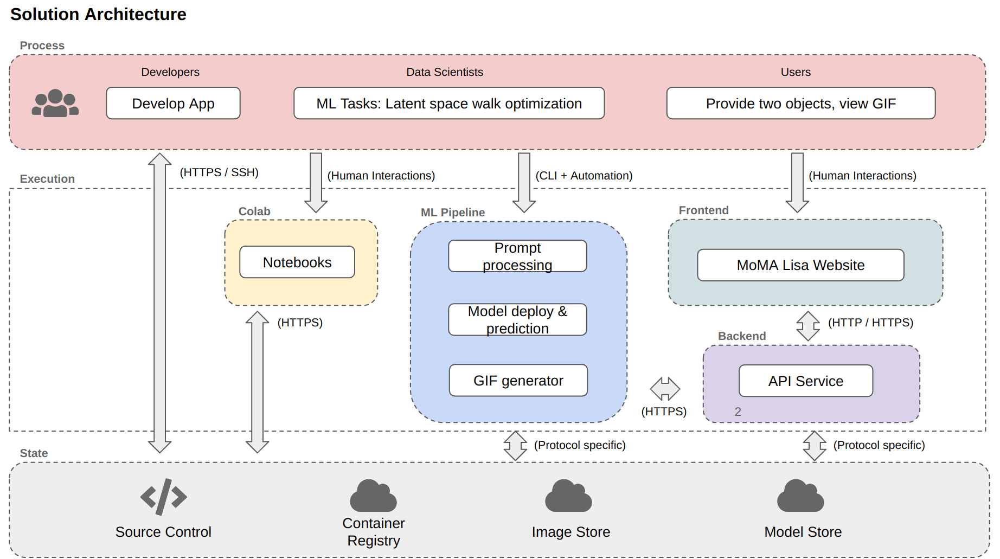

# MOMA Lisa
### Nora Hallqvist, Anna Midgley, Sebastian Weisshaar

**Project Description:**
Our project takes a user's prompt for two points, and generates a continuous series MoMa artworks transitioning between them.
We achieve this by transversing through the latent space, creating intermediate points between the two given points, from which we can decode 
and generate images from. The images are then used to produce a gif, which is displayed to the user.

**Project Journey:**
This is not the first topic we have investigated in this project. Previously, we were hoping to use image and generated caption pairs, to fine-tune a stable diffusion model on MoMA artworks. We set up severless training, that utilized images & captions stored in a GCP bucket with WandB used to track
model training. However, we realized that the model was already to good and consequently we were unable to teach the model anything. For this reason, we decided to pivot to a different idea. We experimented with instead trying to learn specific lesser known artists styles. Unfortunately we realized that for any artist that had satisfactory set of artworks available, the model already knew the style, and again found ourselves unable to teach the model anything. Thus, we have switched to our current topic. It should be noted that the following folders of work in `src` are from previous project
ideas and not applicable to our current idea: `train`, `preprocess`, `scrape`, `data`. 

### Project organization 

    ├── LICENSE
    ├── README.md
    ├── data.dvc
    ├── imgs
    │   ├── ...
    ├── reports
    │   ├── milestone2.md
    │   ├── milestone3.md
    │   └── milestone4.md
    └── src
        ├── docker-compose.yml
        ├── preprocess
        │   ├── Dockerfile
        │   ├── preprocess.py
        │   └── requirements.txt
        ├── scrape
        │   ├── Dockerfile
        │   ├── Pipfile
        │   ├── Pipfile.lock
        │   └── scraper.py
        ├── secrets
        │   ├── data-service-account.json
        │   └── wandb_api_key.json
        ├── train
            ├── Dockerfile
            ├── fetch_train_data.py
            ├── requirements.txt
            ├── train.sh
            └── training_setup.sh
        ├── deploy
            ├── app.py
            ├── Dockerfile
            └── requirements.txt
        └── workflow
            ├── Dockerfile
            ├── pipeline.py
            ├── pipeline.yaml
            └── requirements.txt

### Code structure
* `src/preprocess/preprocess.py` : Fetches MOMA images from 'moma_scrape' GCP bucket, converts the images to png formate and annotates them by generate a text caption and uploads to 'preprocess_data' bucket.

* `src/scrape/scraper.py` : Scrape MOMA collection of artworks currently on display and store jpeg files in 'moma_scrape' GCP bucket. 

* `src/train/fetch_train_data.py` : Fetch training data from 'preprocess_data' bucket and store it for training. 

* `src/train/training_setup.sh` : Collect data and utils file for training. 

* `src/train/train.sh` : Start the fine-tuning of Stable Diffusion, **requires** to first run `training_setup.sh`

* `src/deploy/app.py` : Flask app to deploy model on Vertex AI.

* `src/workflow/pipeline.py` : Create & run pipeline on Vertex AI.

### Bucket structure 
The following is our current structue of files on Google Cloud Storage.

    ├── saved_predictions
    │   └── instance_id
    │       ├── unique_name.gif
            ├── ...

The following is the previous structure of our files. DVC tracking was used to ensure data management, and version control over our data. The `moma_scrape` bucket contained the raw images that were scrapped from the MOMA website. 
The `preprocess_data` bucket contained the processed images, with their corresponding captions. The text captions were stored in the JSONL file. The JSONL file consisted of a series of dictionaries, with each dictionary comprising two  keys: 'file_name' and 'text.' The 'file_name' key corresponds to the image's name, while the 'text' key is the image's caption. The `momalisa_model` bucket stored our model. 

    ├── dvc tracking
    │   ├── ...
    ├── moma_scrape
    │   └── imgs/
    │       ├── ...
    ├── momalisa_model
    ├── preprocess_data
    │   └── train/
    │       ├── metadata.jsonl
            ├── moma_0.png
            ├── moma_1.png
            ├── ...
        

## AC215 - Milestone 5 - MOMA Lisa

This Milestone encomposed:
1. Application Design Document
2. APIs & Frontend Implementation

### Application Design Document
**Solution Architecture:**
The solution architecture for our application is spit between process, execution and state. The solution architecture 
subsections are described in the diagram below, and the entire flow diagram linking the subsections depicted in the diagram after. 

<figure>
    
    <figcaption>MoMA Lisa Solution Architecture SubSections </figcaption>
</figure>

<figure>
    
    <figcaption>MoMA Lisa Solution Architecture Flow Diagram</figcaption>
</figure>

**Technical Architecture:**
