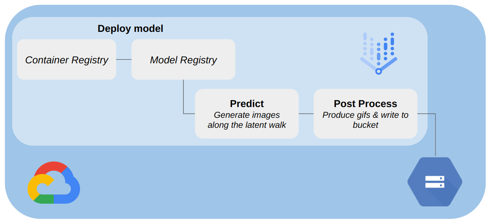

# MOMA Lisa
### Nora Hallqvist, Anna Midgley, Sebastian Weisshaar

**Project Description:**
Our project takes a user's prompt for two points, and generates a continuous series MoMa artworks transitioning between them.
We achieve this by transversing through the latent space, creating intermediate points between the two given points, from which we can decode 
and generate images from. The images are then used to produce a gif, which is displayed to the user.

**Project Journey:**
This is not the first topic we have investigated in this project. Previously, we were hoping to use image and generated caption pairs, to fine-tune a stable diffusion model on MoMA artworks. We set up severless training, that utilized images & captions stored in a GCP bucket with WandB used to track
model training. However, we realized that the model was already to good and consequently we were unable to teach the model anything. For this reason, we decided to pivot to a different idea. We experimented with instead trying to learn specific lesser known artists styles. Unfortunately we realized that for any artist that had satisfactory set of artworks available, the model already knew the style, and again found ourselves unable to teach the model anything. Thus, we have switched to our current topic. It should be noted that the following folders of work in `src` are from previous project
ideas and not applicable to our current idea: `train`, `preprocess`, `scrape`, `data`. 

### Project organization 

    ├── LICENSE
    ├── README.md
    ├── data.dvc
    ├── imgs
    │   ├── ...
    ├── reports
    │   ├── milestone2.md
    │   ├── milestone3.md
    │   └── milestone4.md
    └── src
        ├── docker-compose.yml
        ├── preprocess
        │   ├── Dockerfile
        │   ├── preprocess.py
        │   └── requirements.txt
        ├── scrape
        │   ├── Dockerfile
        │   ├── Pipfile
        │   ├── Pipfile.lock
        │   └── scraper.py
        ├── secrets
        │   ├── data-service-account.json
        │   └── wandb_api_key.json
        ├── train
            ├── Dockerfile
            ├── fetch_train_data.py
            ├── requirements.txt
            ├── train.sh
            └── training_setup.sh
        ├── deploy
            ├── app.py
            ├── Dockerfile
            └── requirements.txt
        └── workflow
            ├── Dockerfile
            ├── pipeline.py
            ├── pipeline.yaml
            └── requirements.txt

### Code structure
* `src/preprocess/preprocess.py` : Fetches MOMA images from 'moma_scrape' GCP bucket, converts the images to png formate and annotates them by generate a text caption and uploads to 'preprocess_data' bucket.

* `src/scrape/scraper.py` : Scrape MOMA collection of artworks currently on display and store jpeg files in 'moma_scrape' GCP bucket. 

* `src/train/fetch_train_data.py` : Fetch training data from 'preprocess_data' bucket and store it for training. 

* `src/train/training_setup.sh` : Collect data and utils file for training. 

* `src/train/train.sh` : Start the fine-tuning of Stable Diffusion, **requires** to first run `training_setup.sh`

* `src/deploy/app.py` : Flask app to deploy model on Vertex AI.

* `src/workflow/pipeline.py` : Create & run pipeline on Vertex AI.

### Bucket structure 
The following is our current structue of files on Google Cloud Storage.

    ├── saved_predictions
    │   └── instance_id
    │       ├── unique_name.gif
            ├── ...

The following is the previous structure of our files. DVC tracking was used to ensure data management, and version control over our data. The `moma_scrape` bucket contained the raw images that were scrapped from the MOMA website. 
The `preprocess_data` bucket contained the processed images, with their corresponding captions. The text captions were stored in the JSONL file. The JSONL file consisted of a series of dictionaries, with each dictionary comprising two  keys: 'file_name' and 'text.' The 'file_name' key corresponds to the image's name, while the 'text' key is the image's caption. The `momalisa_model` bucket stored our model. 

    ├── dvc tracking
    │   ├── ...
    ├── moma_scrape
    │   └── imgs/
    │       ├── ...
    ├── momalisa_model
    ├── preprocess_data
    │   └── train/
    │       ├── metadata.jsonl
            ├── moma_0.png
            ├── moma_1.png
            ├── ...
        

## AC215 - Milestone 4 - MOMA Lisa

This Milestone encomposed:
1. Model deployment 
2. ML pipeline 

## Model Deployment
In this part we deploy our model on  Google Cloud's Vertex AI using a custom Docker container. It encompassed building a Docker image, pushing it to Google Cloud Registry (GCR), and deploying the model using the pushed image. 

For deployment, we have the following files:

- **app.py**: Sets up a Flask application for generating images from text input using a Diffusion Model, offering a text-to-image synthesis API.
- **Dockerfile**: Used to build the image for model deployment.
- **requirements.txt**: Lists the necessary packages to run `app.py`.

Below we provide a step-by-step guide of the process we followed: 

### Prerequisites:
   - **Google Cloud SDK**: Install the Google Cloud SDK on your local machine.

   - **Credentials**: Set up your Google Cloud credentials for authentication.

   - **Role Permissions**: Need to ensure you have the necessary Google Cloud roles for Container Registry access.


### Step 0: Quick Start 
Navigate to the project directory before executing any commands:

   ```bash
   cd src/deploy
   ```

### Step 1: Build and Tag Docker Images:

   Build and tag the Docker image:

   ```bash
   docker build -t gcr.io/cookthis-400019/diffusion_model:latest .
   ```

   Note the docker image follows the following name structure: gcr.io/PROJECT_ID/IMAGE_NAME:TAG


### Step 2: Push Docker Image to GCR:

   After building and tagging, push the image to Google Container Registry (GCR): 

   ```bash
   docker push gcr.io/cookthis-400019/diffusion_model:latest
   ```

### Step 3: Build a Model Using the Image on GCR:

   In terminal use the `gcloud` CLI to build a model using the Docker image you've pushed to GCR:

   ```bash
   gcloud beta ai models upload \
   --region=us-east1 \
   --display-name=diffusion-vertexai-1 \
   --container-image-uri=gcr.io/cookthis-400019/diffusion_model:latest \
   --format="get(model)"
   ```

### Step 4: Deploy the Model via VertexAI UI:

   Deploy your built model through the VertexAI User Interface:

   - Navigate to Model Registry
   - Deploy the Model:
     1. Find and click on your model within the registry.
     2. Click on `DEPLOY AND TEST`, followed by `DEPLOY TO ENDPOINT`.
     3. To successfully deploy the model, select a single TESLA T4 GPU.


## ML Pipeline
In this part we created a ML pipeline using Google Cloud's Vertex AI. The pipeline consisted
of two main steps, predict & post-processing. In the first step, we made predictions using the model stored in the model
registry. The predictions consist of calculating the latent space path between two points, and generating images for 
these intermediate points. In the second step, we post-process the predictions, by converting the images to a gif, and
saving these to a bucket. In the diagram below, we can see this pipeline visualized.
<figure>
    
    <figcaption>ML Pipeline. </figcaption>
</figure>
We used Kubeflow Pipelines to create the pipeline, which consisted of `dsl` components. This pipeline's directed
acyclic graph was created in the file `pipeline.py`. This script also ships the code off to Vertex AI Pipelines, which
runs each of the steps in the order specified. The images below shows the simple DAG implemented in Vertex AI. 
<figure>
    
    <figcaption>ML Pipeline DAG. </figcaption>
</figure>

## Future Steps

1. **Investigate Non-Linear Walks:** Explore the potential advantages of implementing non-linear walks within the latent spaces. This involves taking smaller steps in the middle of the two images when compared to the two endpoints.

2. **Hide latency by utilizing both latent spaces:** Combining walking in both the text and image latent spaces. Efficiently managing both latent spaces simultaneously can lead to smoother interactions and faster response times.

3. **Design a User-Friendly Frontend:** We aim to create a user-friendly frontend that allows users to easily interact with our model. This includes enabling users to specify two prompts and generate GIFs.
