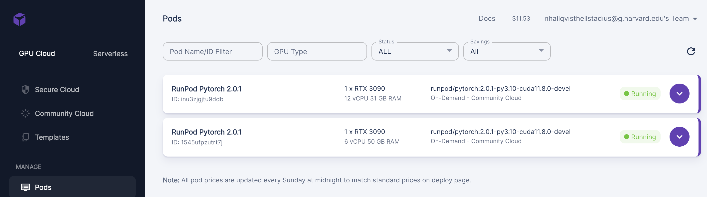

# MOMA Lisa'
### Nora Hallqvist, Anna Midgley, Sebastian Weisshaar

**Project Description:**
Our project takes a user's prompt, and generates a MoMa artwork. We finetune Stable Diffusion with the artworks currently on display in the Museum Of Modern Art (MOMA) in New York. 

## AC215 - Milestone 3 - MOMA Lisa

### Milestone 3
Milestone 3 contains two changes: 1) we changed the topic of the project from recipes to art and 2) we implemented the training pipeline. 

We saw 
### Training setup
The ~1200 images collected from MOMA are annotated using a image-to-text model.  We prepend the string "A MOMA artwork of: " to these annotations. The MOMA art work together with these descriptions form our training data. We use these pairs to fine-tune SD 

### Experiment tracking
We tracked our trainig using [Weights and Biases]('https://wandb.ai/site'). First we ran 3 smaller experiments to see if the training works correctly, the validation prompts are evaluated and the loss is decreasing. The graph shows a jumpy loss function during training. Based on this graph and the caveat on [HuggingFace]('https://huggingface.co/docs/diffusers/v0.13.0/en/training/text2image') about catastrophic forgetting we decided to reduce our learning rate from 10e-8 to 10e-9. 

<figure>
    
    <figcaption>W&B loss logging</figcaption>
</figure>

During training five evaluation prompts are evaluated every 250 steps. These prompts give us an insight into the style SD is using. The standard loss function is not of much use for our use case. We try to teach SD an 'artsy' style, which is not captured by a loss function comparing two images but has to be evaluated by humans. The prompts are: 

1. A MOMA artwork of: changing seasons
2. A MOMA artwork of: a coffee
3. A MOMA artwork of: an industrial setting
4. A MOMA artwork of: critique of the USA
5. A MOMA artwork of: Picasso and Monet. 

We cherry picked an example for each of these prompts from our training.
<figure style="float: left">
    
    <figcaption>A MOMA artwork of: changing seasons</figcaption>
</figure> 
<figure style="float: right">
    
    <figcaption>A MOMA artwork of: a coffee</figcaption>
</figure> 
<figure style="float: left">
    
    <figcaption>A MOMA artwork of: an industrial setting</figcaption>
</figure> 
<figure style="float: right">
    
    <figcaption>A MOMA artwork of: critique of the USA</figcaption>
</figure> 
<figures style="float: center">
    
    <figcaption>A MOMA artwork of: Picasso and Monet</figcaption>
</figure> 

### Serverless training
We use [RunPod]('https://www.runpod.io/) to run our training. RunPod rents out different GPU per hour, with high availibilty. You can also use it for mutli-GPU training. For our Stable Diffusion finetuning we used a single RTX 3090 GPU with 24GB of VRAM. The fine-tuning training takes ~2.5 hrs on this GPU. 
<figure>
    
    <figcaption>GPU specification and cost on RunPod. </figcaption>
</figure>

### Code structure