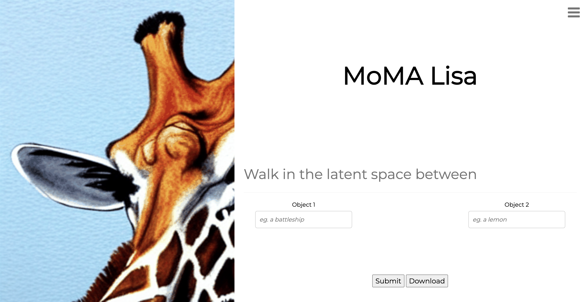
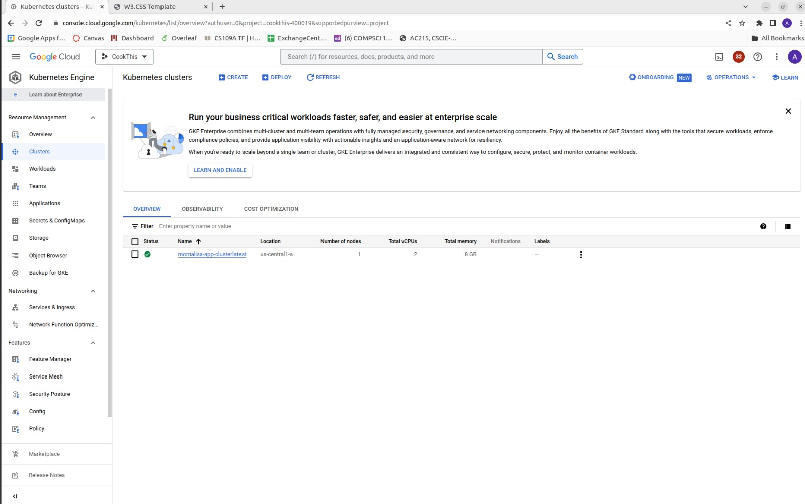
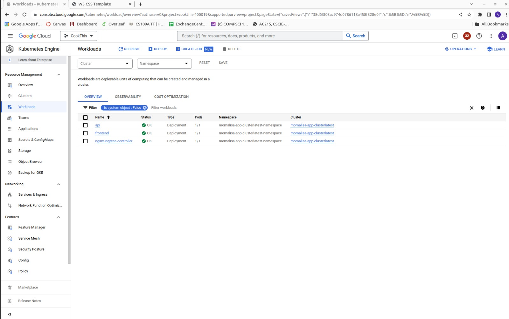

# MOMA Lisa
### Nora Hallqvist, Anna Midgley, Sebastian Weisshaar

---
### Presentation  Video
* \<Link Here>

### Blog Post Link
*  [Blog Post](https://medium.com/@amidgley_80993/a27ca3ef0090)
---

**Project Description:**
Our project takes a user's prompt for two points, and generates a continuous series MoMa artworks transitioning between them.
We achieve this by transversing through the latent space, creating intermediate points between the two given points, from which we can decode 
and generate images from. The images are then used to produce a gif, which is displayed to the user.

**Project Journey:**
This is not the first topic we have investigated in this project. Previously, we were hoping to use image and generated caption pairs, to fine-tune a stable diffusion model on MoMA artworks. We set up severless training, that utilized images & captions stored in a GCP bucket with WandB used to track
model training. However, we realized that the model was already to good and consequently we were unable to teach the model anything. For this reason, we decided to pivot to a different idea. We experimented with instead trying to learn specific lesser known artists styles. Unfortunately we realized that for any artist that had satisfactory set of artworks available, the model already knew the style, and again found ourselves unable to teach the model anything. Thus, we have switched to our current topic. It should be noted that the following folders of work in `src` are from previous project
ideas and not applicable to our current idea: `train`, `preprocess`, `scrape`, `data`. 

### Project organization 

    ├── LICENSE
    ├── README.md
    ├── data.dvc
    ├── imgs
    │   └── ...
    ├── reports
    │   └── ...
    └── src
        ├── docker-compose.yml
        ├── preprocess
        │   └── ...
        ├── scrape
        │   └── ...
        ├── secrets
        │   └── ...
        ├── train
        │   └── ...
        ├── deploy_model
        │   └── ...
        ├── workflow
        │   └── ...
        ├── frontend-simple
        │   ├── imgs
        │   ├── docker-shell.sh
        │   ├── Dockerfile
        │   └── index.html
        ├── api-service
        │   ├── api
        │   │   ├── model.py
        │   │   └── service.py
        │   ├── docker-entrypoint.sh
        │   ├── docker-shell.sh
        │   ├── Dockerfile
        │   ├── Pipfile
        │   └── requirements.txt
        └── deployment
            └── nginx-conf/nginx
                └── nginx.conf
            ├── deploy-create-instance.yml
            ├── deploy-docker-images.yml
            ├── deploy-k8s-cluster.yml
            ├── deploy-provision-instance.yml
            ├── deploy-setup-containers.yml
            ├── deploy-setup-webserver.yml
            ├── docker-entrypoint.sh 
            ├── docker-shell.sh
            ├── Dockerfil
            └── inventory.yml

### Code structure
We have focused on providing a code structure description for the section of work we have added this milestone.

**Frontend:**
* `src/frontend-simple/docker-shell.sh` : This script is used to build and launch the container for the frontend.
* `src/frontend-simple/Dockerfile` : This file is used to specify the frontend container image.
* `src/frontend-simple/index.html` : This file is the html file for the frontend. It contains the html code for the website.

**API Service/Backend:**
* `src/api-service/api/model.py` : This file make predictions from the deployed model.
* `src/api-service/api/service.py` : This file is used to create the API service, and connect to the deployed model and call the predict function.
* `src/api-service/docker-entrypoint.sh` : This script is used to define the entrypoint for the backend container.
* `src/api-service/docker-shell.sh` : This script is used to build and launch the container for the API service container.
* `src/api-service/Dockerfile` : This file is used to specify the API service container image.
* `src/api-service/Pipfile` and `src/api-service/requirements.txt` : These files are used to specify the dependencies for the API service.

**Deployment:**
* `src/deployment/deploy-create-instance.yml` : This file is used to create a VM instance on GCP.
* `src/deployment/deploy-docker-images.yml` : This file is used to build and push the docker images to GCR for both the frontend and backend containers.
* `src/deployment/deploy-k8s-cluster.yml` : This file is used to deploy the k8s cluster.
* `src/deployment/deploy-provision-instance.yml` : This file is used to provision the VM instance.
* `src/deployment/deploy-setup-containers.yml` : This file is used to set up the containers on the VM instance, pulling them from the container registry.
* `src/deployment/deploy-setup-webserver.yml` : This file is used to set up the webserver on the VM instance, which uses nginx to connect the frontend & backend containers.
* `src/deployment/docker-entrypoint.sh` : This script is used to define the entrypoint for the deployment container.
* `src/deployment/docker-shell.sh` : This script is used to build and launch the container for the deployment container, from which the ansible playbooks can be called.
* `src/deployment/Dockerfile` : This file is used to specify the deployment container image.
* `src/deployment/inventory.yml` : This file is used to specify the VM instance, and the containers that will be run on it.

### Bucket structure 
The following is our current structure of files on Google Cloud Storage.

    ├── saved_predictions
    │   └── instance_id
    │       ├── unique_name.gif
            ├── ...

The following is the previous structure of our files. DVC tracking was used to ensure data management, and version control over our data. The `moma_scrape` bucket contained the raw images that were scrapped from the MOMA website. 
The `preprocess_data` bucket contained the processed images, with their corresponding captions. The text captions were stored in the JSONL file. The JSONL file consisted of a series of dictionaries, with each dictionary comprising two  keys: 'file_name' and 'text.' The 'file_name' key corresponds to the image's name, while the 'text' key is the image's caption. The `momalisa_model` bucket stored our model. 

    ├── dvc tracking
    │   ├── ...
    ├── moma_scrape
    │   └── imgs/
    │       ├── ...
    ├── momalisa_model
    ├── preprocess_data
    │   └── train/
    │       ├── metadata.jsonl
            ├── moma_0.png
            ├── moma_1.png
            ├── ...
        
---

## AC215 - Milestone 6 - MOMA Lisa

## APIs & Frontend Implementation
**API Service/Backend:**
The backend API service connects to our deployed model which is hosted on Vertex AI. This allows us to make predictions, 
generating images along the latent space walk. When we call the model, the predictions are also written to a GCP bucket.

To run the container locally, follow these simple steps:

1. Open a terminal and navigate to the `src/api-service` directory.
2. Run the following command:

   ```bash
   sh docker-shell.sh
   ```

3. Once the container is up and running, access the api locally by visiting [http://localhost:9000](http://localhost:3000) in your web browser.


**Deploying the Model on Vertex AI**
Before launching the website, the model stored on Vertex AI must be deployed. These steps must be completed:  
1. Navigate to the Vertex AI on Google Cloud.
2. In the Model Registry, select the region as US-east1.
3. Locate and click on the model named "diffusion-vertexai-4."
4. Under the "Deploy and Test" tab, click on "Deploy to Endpoint."
5. In the deployment configuration, choose "NVIDIA_TESLA_T4" as the accelerator type.
6. After the model is successfully deployed, copy the provided ID number.
7. Open the Python file named `model.py` found in `src/api-service/api`.
8. Locate the following line of code in `model.py`:

    ```python
    endpoint = aiplatform.Endpoint(
        "projects/580339194016/locations/us-east1/endpoints/{ID}"
    )
    ```

9. Replace `{ID}` with the copied ID number from the deployed model.
Now, the model is linked to the correct endpoint, and you can proceed with launching the website.

**Frontend:**
The frontend we have created allows a user to input two objects, from which a gif will be generated that captures the latent space walk. The generated gif is placed on the left side of the webise and can be downloaded from the website. 

Our website additionally has a GIF gallery, where users can view previously generated gifs and gain inspiration. Lastly it has a small section discussing the project, link to our source code, and the team members. Please refer to the image below to see how the user interacts with the website to generate and download a gif. In addition a video is provided below for a tour of the webiste. 

To to view the website locally, follow these simple steps:

1. Open a terminal and navigate to the `src/frontend-simple` directory.
2. Run the following command:

   ```bash
   sh docker-shell.sh
   ```

3. Once the container is up and running, access the app locally by visiting [http://localhost:3000](http://localhost:3000) in your web browser.


<figure>
    
    <figcaption>Part of website where user inputs prompts and can generate a GIF</figcaption>
</figure>


### Video 
Check out a demo of our project [here](https://youtu.be/PUSkKIgtY2E)

## Kubernetes Setup and Deployment
For scaling purposes we set up Kubernetes. Kubernetes simplifies and automates the deployment, scaling, and management of containerized applications, providing a robust and scalable infrastructure orchestration solution

The following commands are used to deploy our application:

1. Build the deployment container: `sh docker-shell.sh`
2. Create and deploy the cluster: `ansible-playbook deploy-k8s-cluster.yml -i inventory.yml --extra-vars cluster_state=present`
3. Copy the `nginx_ingress_ip` from the terminal from the create cluster command
4. Visit the website: `http://<INGRESS IP>.sslip.io`

To delete the cluster, run the following command: `ansible-playbook deploy-k8s-cluster.yml -i inventory.yml --extra-vars cluster_state=absent`

Check out these screenshots showcasing a successfully configured Kubernetes setup:

## Kubernetes Cluster Screenshots

<figure>
    
    <figcaption>Running Cluster </figcaption>
</figure>


<figure>
    
    <figcaption>Workloads (containers) in running cluster </figcaption>
</figure>

Additionally, you can watch a video demonstration where we navigate to the website hosted on the Kubernetes cluster [here](https://www.youtube.com/watch?v=161SAMJLeeY).


## GitHub Actions
We implemented a CI/CD using GitHub Actions, such that we can trigger deployment using GitHub Events. The yaml file which sets up the workflow can be found in the folder .github/workflows.

Our pipeline is simple, and does not require data collection nor data processing. Therefore the only Action we define is to setup the Kubernetes cluster with our app deployed. A brief description of the details of the action is listed below:

- the workflow is triggered on a push event to the main branch.
- the job is conditional on the commit message containing /run-deploy-app.
- the workflow runs in Ubuntu, and checks out the repository code
- builds the deployment container with the necessary GC credentials, and runs the script deploy-app.sh, which deploys the latest docker images for the frontend and api-service, and sets up the K8 clusters
